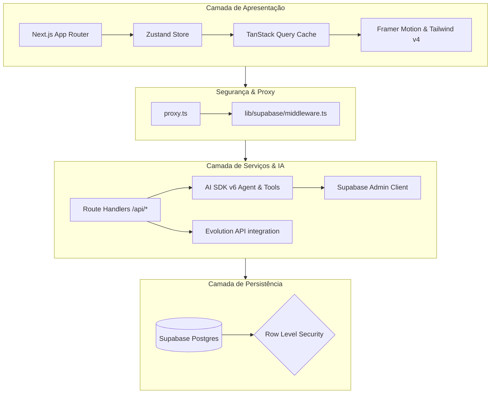

# DOCUMENTACAO.md - Documentação Técnica do GenialCRM

Este documento provê uma visão técnica aprofundada da arquitetura, estrutura de arquivos, fluxo de dados, camada de banco de dados, políticas de segurança e diretrizes para desenvolvedores do **GenialCRM**.

---

## 🚀 1. Visão Geral do Sistema e Arquitetura

O **GenialCRM** é um sistema de Gestão de Relacionamento com Clientes (CRM) inteligente, multi-tenant e integrado a assistentes de Inteligência Artificial. A sua arquitetura foi concebida para oferecer alta performance, isolamento robusto entre diferentes organizações (tenancy) e uma interface responsiva enriquecida com animações fluidas.



### Principais Pilares da Stack
*   **Framework Principal**: [Next.js 16 (App Router)](https://nextjs.org/) utilizando a estrutura de React 19.
*   **Banco de Dados & Autenticação**: [Supabase](https://supabase.com/) (PostgreSQL + RLS + Go-True Auth + Realtime).
*   **Gerenciamento de Estado**: [Zustand](https://zustand.docs.pmnd.rs/) para estado local global leve e [TanStack Query v5](https://tanstack.com/query/latest) para sincronização e cache de dados de APIs.
*   **Inteligência Artificial**: [Vercel AI SDK v6](https://sdk.vercel.ai/docs) fornecendo agentes autônomos (`ToolLoopAgent`) integrados com múltiplos provedores (Google Gemini, OpenAI e Anthropic).
*   **Estilização**: Tailwind CSS v4 e animações baseadas no Framer Motion v12.
*   **Integração WhatsApp**: Integração direta com a Evolution API v2 para troca de mensagens de texto, áudio e mídia criptografada.

---

## 📂 2. Estrutura de Pastas e Responsabilidades

Abaixo está o mapeamento detalhado da estrutura física do projeto e a responsabilidade de cada diretório:

*   [`app/`](file:///c:/Users/felip/Desktop/Lista%20de%20CNPJ/Nova%20pasta/gsdcrm/app): Contém as rotas e páginas do aplicativo Next.js (App Router).
    *   [`app/(protected)/`](file:///c:/Users/felip/Desktop/Lista%20de%20CNPJ/Nova%20pasta/gsdcrm/app/(protected)): Rotas que exigem autenticação ativa. Inclui as seções de dashboard, boards (pipeline), contatos, relatórios, configurações e a tela de decisões do assistente de IA.
    *   [`app/api/`](file:///c:/Users/felip/Desktop/Lista%20de%20CNPJ/Nova%20pasta/gsdcrm/app/api): Route Handlers do Next.js. Exemplo: endpoints de sincronização de mensagens, geração de relatórios por IA, e recepção de webhooks da Evolution API.
    *   [`app/auth/`](file:///c:/Users/felip/Desktop/Lista%20de%20CNPJ/Nova%20pasta/gsdcrm/app/auth): Fluxos de callback de autenticação do Supabase.
    *   [`app/install/`](file:///c:/Users/felip/Desktop/Lista%20de%20CNPJ/Nova%20pasta/gsdcrm/app/install): Wizard de instalação automatizada na Vercel e inicialização do banco.
    *   [`app/setup/`](file:///c:/Users/felip/Desktop/Lista%20de%20CNPJ/Nova%20pasta/gsdcrm/app/setup): Fluxo inicial de configuração para criação de organização em novas contas.
*   [`features/`](file:///c:/Users/felip/Desktop/Lista%20de%20CNPJ/Nova%20pasta/gsdcrm/features): Módulos organizados por domínios de negócio para manter o código acoplado de forma lógica.
    *   [`features/boards/`](file:///c:/Users/felip/Desktop/Lista%20de%20CNPJ/Nova%20pasta/gsdcrm/features/boards): Componentes e lógica do pipeline Kanban, detalhamento de deals e cartões.
    *   [`features/contacts/`](file:///c:/Users/felip/Desktop/Lista%20de%20CNPJ/Nova%20pasta/gsdcrm/features/contacts): Gestão de clientes, importação via CSV e empresas vinculadas.
    *   [`features/ai-hub/`](file:///c:/Users/felip/Desktop/Lista%20de%20CNPJ/Nova%20pasta/gsdcrm/features/ai-hub): Interface do painel inteligente, scripts e sugestões geradas por IA.
*   [`components/`](file:///c:/Users/felip/Desktop/Lista%20de%20CNPJ/Nova%20pasta/gsdcrm/components): Componentes compartilhados e atômicos (UI genérica baseada em Radix e classes utilitárias).
*   [`lib/`](file:///c:/Users/felip/Desktop/Lista%20de%20CNPJ/Nova%20pasta/gsdcrm/lib): Utilitários, hooks comuns e integrações do sistema.
    *   [`lib/supabase/`](file:///c:/Users/felip/Desktop/Lista%20de%20CNPJ/Nova%20pasta/gsdcrm/lib/supabase): Configuração e clientes do Supabase (Client, Server, Middleware, Service-role).
    *   [`lib/ai/`](file:///c:/Users/felip/Desktop/Lista%20de%20CNPJ/Nova%20pasta/gsdcrm/lib/ai): Agente de IA (`crmAgent.ts`) e definição das 15 ferramentas nativas (`tools.ts`).
    *   [`lib/integrations/`](file:///c:/Users/felip/Desktop/Lista%20de%20CNPJ/Nova%20pasta/gsdcrm/lib/integrations): Cliente de conexão com a API do WhatsApp/Evolution.
        *   [`lib/integrations/evolution/webhook-helpers.ts`](file:///c:/Users/felip/Desktop/Lista%20de%20CNPJ/Nova%20pasta/gsdcrm/lib/integrations/evolution/webhook-helpers.ts): Funções utilitárias para parsing de mensagens WhatsApp (texto, imagem, áudio, vídeo, documento, sticker), extração de números de telefone com suporte ao nono dígito brasileiro, variações de formato e seleção do melhor candidato de telefone via scoring.
        *   [`lib/integrations/evolution/webhook-persistence.ts`](file:///c:/Users/felip/Desktop/Lista%20de%20CNPJ/Nova%20pasta/gsdcrm/lib/integrations/evolution/webhook-persistence.ts): Lógica de persistência do webhook: `logWebhookEvent` (registro de eventos em `webhook_events_in`), `resolveOrganizationId` (resolução da organização pela instância Evolution), e `persistInboundMessage` (criação automática de contatos e deals para novos leads, com log detalhado de erros).
    *   [`lib/stores/`](file:///c:/Users/felip/Desktop/Lista%20de%20CNPJ/Nova%20pasta/gsdcrm/lib/stores): Gerenciamento de estado global com Zustand, modularizado por domínio.
        *   [`lib/stores/ui-store.ts`](file:///c:/Users/felip/Desktop/Lista%20de%20CNPJ/Nova%20pasta/gsdcrm/lib/stores/ui-store.ts): Estado de interface (sidebar, modais, busca global, loading) com seletores de performance.
        *   [`lib/stores/form-store.ts`](file:///c:/Users/felip/Desktop/Lista%20de%20CNPJ/Nova%20pasta/gsdcrm/lib/stores/form-store.ts): Rascunhos de formulário com persistência em localStorage e estados de submissão.
        *   [`lib/stores/notification-store.ts`](file:///c:/Users/felip/Desktop/Lista%20de%20CNPJ/Nova%20pasta/gsdcrm/lib/stores/notification-store.ts): Notificações toast com auto-dismiss configurável.
        *   [`lib/stores/index.ts`](file:///c:/Users/felip/Desktop/Lista%20de%20CNPJ/Nova%20pasta/gsdcrm/lib/stores/index.ts): Barrel re-export mantendo compatibilidade com `@/lib/stores`.

*   [`supabase/`](file:///c:/Users/felip/Desktop/Lista%20de%20CNPJ/Nova%20pasta/gsdcrm/supabase): Migrations de banco de dados (`migrations/`), funções serverless (`functions/`) e reset scripts.

---

## 🔄 3. Fluxo de Dados e Autenticação (Proxy)

A proteção das rotas do projeto baseia-se na especificação oficial do Next.js 16+ usando o arquivo [`proxy.ts`](file:///c:/Users/felip/Desktop/Lista%20de%20CNPJ/Nova%20pasta/gsdcrm/proxy.ts) localizado na raiz do projeto.

1.  O arquivo [`proxy.ts`](file:///c:/Users/felip/Desktop/Lista%20de%20CNPJ/Nova%20pasta/gsdcrm/proxy.ts) intercepta requisições de navegação do browser (excluindo explicitamente requisições de `/api/*` para não quebrar integrações/chats e assets estáticos).
2.  Ele repassa a validação para o arquivo [`lib/supabase/middleware.ts`](file:///c:/Users/felip/Desktop/Lista%20de%20CNPJ/Nova%20pasta/gsdcrm/lib/supabase/middleware.ts).
3.  **Renovação da Sessão**: O middleware invoca `supabase.auth.getUser()` para renovar o token JWT nos cookies do browser.
4.  **Setup Guard**: Verifica no banco se a instância já foi inicializada (`supabase.rpc('is_instance_initialized')`). Caso contrário, redireciona o usuário imediatamente para a rota `/setup`.
5.  **Redirecionamentos de Segurança**: Redireciona usuários deslogados tentando acessar páginas restritas para `/login`, e usuários autenticados na rota `/login` para o `/dashboard`.

---

## 🛠️ 4. Integrações e Funcionalidades Centrais

### 🤖 4.1 Assistente de IA (Pilot)
O GenialCRM integra agentes inteligentes usando o **Vercel AI SDK v6**.

*   **Endpoint**: [`app/api/ai/chat/route.ts`](file:///c:/Users/felip/Desktop/Lista%20de%20CNPJ/Nova%20pasta/gsdcrm/app/api/ai/chat/route.ts)
*   **Modelo de Agente**: `ToolLoopAgent` instanciado com suporte a múltiplos provedores (`google` / `openai` / `anthropic`) parametrizado nas configurações da organização.
*   **Injeção de Contexto**: A rota lê dados do "Cockpit" (dados da tela atual que o usuário está visualizando: cards, estágios, atividades pendentes, etc.) e anexa no prompt de sistema através da função `prepareCall`.
*   **Lembrete de Histórico**: O loop do agente identifica IDs de negócios e contatos retornados em execuções de ferramentas anteriores e injeta um lembrete implícito no passo seguinte (`prepareStep`) para manter coerência sem re-consultar o banco.
*   **Bypass de Aprovação**: Ações mutativas (como criar, mover ou encerrar negócios) possuem a propriedade `needsApproval: true`. A interface renderiza cards especiais de aprovação em tempo de execução. Em desenvolvimento ou testes automatizados, `AI_TOOL_APPROVAL_BYPASS=true` permite pular esse gate.
*   **Mecanismo de Retentativas e Fallback**: Caso ocorra limite de requisições (Status 429) ou erros de provedor (5xx), o agente possui um handler de fetch personalizado com backoff exponencial que substitui automaticamente o modelo configurado por um modelo estável padrão (como o modelo padrão do OpenAI) para manter o serviço no ar de forma transparente.

### 💬 4.2 Integração com WhatsApp (Evolution API)
A comunicação em tempo real via WhatsApp ocorre através da conexão com instâncias da **Evolution API v2**.

*   **Conexões e Webhooks**: O sistema auto-configura e valida o status da conexão do WhatsApp. O webhook registra no servidor instabilidade e atualizações de conexão, ouvindo por eventos de mensagens (ex: `MESSAGES_UPSERT` do Evolution API v2, normalizado no backend como `messages.upsert`).
*   **Tratamento do Nono Dígito (Brasil)**: Para sanar a incompatibilidade entre números do WhatsApp móvel brasileiro de 12 dígitos (sem o 9) e 13 dígitos (com o 9), o sistema utiliza a função helper `getBrPhoneVariations` para gerar ambas as variações de formato do telefone. O webhook realiza as consultas na tabela de contatos e no histórico de mensagens usando o operador `.in()`, permitindo identificar e correlacionar o lead no banco de dados mesmo que ele envie mensagens de um formato diferente do que foi cadastrado no CRM.
*   **Criação Resiliente de Contato e Deal (Leads)**: Caso a mensagem de WhatsApp seja recebida de um remetente totalmente desconhecido (sem contatos correspondentes e sem mensagens outbound anteriores), o Route Handler do webhook (`app/api/webhooks/evolution/route.ts`) realiza automaticamente a criação do contato na tabela `contacts` (com a etapa `LEAD`) e insere um negócio (deal) na primeira etapa (stage) do primeiro board ativo da organização correspondente. Isso garante o recebimento do lead mesmo na ausência de fontes de integração ou webhooks externos configurados.
*   **Suporte Multimídia**:
    *   **Mensagens Recebidas**: O webhook do Evolution salva o payload estruturado contendo o tipo da mensagem (texto, imagem, áudio, vídeo, stickers, etc.), capturando captions, mime-types e base64.
    *   **Fallback CDN**: Quando o base64 de mídias recebidas não vem no webhook, o backend invoca o endpoint `/chat/getBase64FromMediaMessage/{instance}` da Evolution para baixar o arquivo criptografado da CDN do WhatsApp e hidratá-lo localmente na tabela `whatsapp_messages`.
     *   **Envio de Mídia**: O frontend captura mídias através do chat e envia arquivos. Formatos de áudio gravados localmente no microfone do navegador via `MediaRecorder` são normalizados retirando-se o prefixo de dados Data-URL (`data:audio/ogg;base64,...`) por meio do helper `toEvolutionMedia` antes do payload ser transmitido para a Evolution API.
*   **Logs e Diagnóstico**: Todo evento recebido pela Evolution API é logado na tabela `webhook_events_in` via `logWebhookEvent`, incluindo:
    *   Eventos ignorados (`status: 'skipped'`) com o motivo (evento não-`messages.upsert`, mensagem própria, grupo, telefone inválido).
    *   Eventos processados (`status: 'processed'`) com `created_contact_id` e `created_deal_id` quando um novo lead é criado.
    *   Erros de criação de contato ou deal (`status: 'error'`) com detalhes do erro.
    *   O painel **Configurações > Logs de Webhook** (`/settings/logs`) exibe esses eventos em tempo real com auto-refresh, permitindo diagnosticar falhas de integração.

### 🎨 4.3 Identidade Visual e Logos
O sistema possui suporte para exibição dinâmica de logotipos de alta performance com fundo transparente nos formatos otimizados **WebP**:

*   **Processamento de Logos**: Os logotipos originais de fundo sólido (`Logo_para_fundo_claro.png` e `Logo_para_fundo_escuro.png`) foram processados via script Python utilizando o algoritmo de Flood-fill BFS a partir dos cantos externos para remover o fundo de forma não destrutiva, seguido do corte automático (croppagem) das margens transparentes.
*   **Armazenamento**:
    *   `/logo_light.webp`: Logo com transparência otimizada para temas/layouts claros.
    *   `/logo_dark.webp`: Logo com transparência otimizada para temas/layouts escuros.
*   **Comutação Reativa**: A sidebar principal (`components/Layout.tsx`) e o menu responsivo de tablets (`components/navigation/NavigationRail.tsx`) consomem dinamicamente `/logo_dark.webp` ou `/logo_light.webp` dependendo da propriedade `darkMode` em tempo de execução, garantindo contraste perfeito em todos os contextos de tema do CRM.

---


## 🔒 5. Banco de Dados e Segurança Multi-tenant (RLS)

O GenialCRM possui isolamento completo de dados por organização. Isso garante que nenhum dado (negócios, contatos, notas, mensagens) vaze entre diferentes organizações.

### 🛡️ Políticas de RLS
A migration [`20260529170000_tighten_core_rls.sql`](file:///c:/Users/felip/Desktop/Lista%20de%20CNPJ/Nova%20pasta/gsdcrm/supabase/migrations/20260529170000_tighten_core_rls.sql) reestruturou toda a segurança do banco, introduzindo helpers determinísticos de segurança:

1.  `current_user_organization_id()`: Retorna o ID da organização do usuário logado baseado em `auth.uid()`.
2.  `is_org_member(org_id)`: Valida se o usuário pertence à organização especificada.
3.  `is_org_admin(org_id)`: Valida se o usuário autenticado é um administrador daquela organização.

Todas as tabelas de domínio do CRM possuem RLS ativo com a política `tenant_member_access`:
```sql
CREATE POLICY "tenant_member_access" ON public.contacts
  FOR ALL TO authenticated
  USING (public.is_org_member(organization_id))
  WITH CHECK (public.is_org_member(organization_id));
```

### ⚡ Gatilho Automático de Organização (Trigger)
Para prevenir erros de inserção quando o frontend ou um webhook externo não envia explicitamente o `organization_id`, a migration [`20260601162000_default_org_on_lead_inserts.sql`](file:///c:/Users/felip/Desktop/Lista%20de%20CNPJ/Nova%20pasta/gsdcrm/supabase/migrations/20260601162000_default_org_on_lead_inserts.sql) adiciona um gatilho de banco que autocompleta o campo `organization_id` baseado no perfil do usuário logado:

```sql
create trigger set_contacts_organization_id
  before insert on public.contacts
  for each row
  execute function public.set_current_user_organization_id();
```

---

## 💡 6. Diretrizes para Desenvolvedores e Boas Práticas

### 🚀 6.1 Regras de Cache (TanStack Query)
*   **Regra de Ouro**: Há apenas uma fonte de verdade para a cache de negócios (deals). Qualquer mutação (criar, arrastar, fechar deal) deve invalidar ou atualizar o cache utilizando a chave canônica `[...queryKeys.deals.lists(), 'view']`.
*   **Filtros**: Não crie caches de query filtrados individualmente para não fragmentar a interface. Prefira buscar a listagem completa na cache e filtrar client-side através do seletor `select` do TanStack Query.
*   **Atualização Otimista**: Dê preferência a `queryClient.setQueryData` sobre `invalidateQueries` para fornecer feedback visual instantâneo para o usuário.

### 📝 6.2 Estilo de Código e Linting
*   **Tipagem Estrita**: Toda a base de código deve ser estritamente tipada com TypeScript 5.x.
*   **Componentes**: Componentes reutilizáveis ficam em `components/ui/`, enquanto componentes dedicados a domínios de negócio residem no módulo correspondente em `features/`.
*   **Imports**: Sempre use os aliases `@/` (ex: `@/lib/utils`, `@/components/ui/button`).
*   **Linting**: O linter é executado com `--max-warnings 0` de modo que nenhum warning ou erro seja ignorado.

### 🧪 6.3 Testes Automatizados
O projeto utiliza **Vitest** com ambiente `happy-dom` e React Testing Library para garantir a estabilidade do sistema.
*   Para rodar todos os testes de forma única: `npm run test:run`
*   Para rodar em modo watch durante o desenvolvimento: `npm run test`
*   Para rodar testes de integração/RBAC específicos: `npx vitest test/tools.multiTenant.test.ts`
